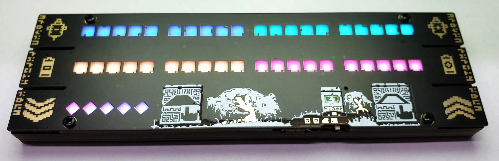

### For more pictures and info see:
www.pegasusprototyping.ca/stattracker

# Stat Tracker
The ***Stat Tracker*** is a portable battery powered device that keeps track of ***health, energy, and dashes*** for the Hyper Light Drifter Table Top Role Playing Game. Although it was designed with Hyper Light Drifter in mind, it could be used in other table top games like Dungeons and Dragons. 

Features:

 - Tracks 40 points of Health and Energy and 10 points in Dashes
 - Bright RGB leds for each icon
 - Custom art in Hyper Light Drifter theme
 - Unique Slim PCB sandwich construction with special icons for LED diffusion
 - 6 physical pcb buttons to add/subtract points
 - 2 touch buttons for brightness control
 - Customizable colour palettes including colourblind modes
 - USB micro for charging
 - 8 hours of battery life on default brightness and battery charge indicator icon
 - Stats are saved on power off.

 # Code

 The stat tracker uses a very cheap 50 cent chinese mcu called the CH552. The tool chain setup is explained in https://github.com/Blinkinlabs/ch554_sdcc.

 The stat tracker code is contained in the examples folder "examples/stat_tracker"

 Some c files were created/modified to help use the ch552 such as:
 - button.c     usage of buttons and their states
 - touch.c      touch button usage
 - timer.c      set up timers for millis()

 # Eagle Source files

Eagle Source files are included. (Eagle Version 9.6.1 was used). See README in Eagle files for bom/board information.

